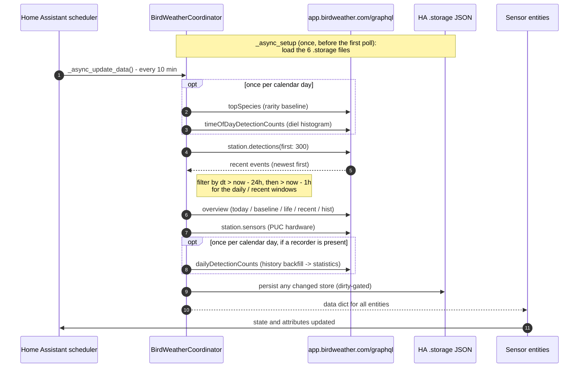

# BirdWeather API interactions

This page documents every network call the integration makes — which GraphQL
queries it sends, when, with what variables, and what it does with the responses.
It's a reference for debugging API behaviour, planning rate budgets, or reasoning
about offline resilience.

The integration is a one-way **cloud_polling** consumer of BirdWeather's public
GraphQL API. It never writes back.

## The endpoint

A single GraphQL endpoint serves everything:

```
POST https://app.birdweather.com/graphql
```

All requests are **anonymous** — no API token or account. They go through Home
Assistant's shared `aiohttp` session (`async_get_clientsession(hass)`) with a
`User-Agent: ha-birdweather` header. The station ID is passed as a query
variable, never a credential. Bird photos are remote BirdWeather CDN URLs the
cards load directly (no image download/cache), and audio "play the call" streams
the soundscape clip in the browser — neither is fetched by the integration.

**Source:** [`client.py`](../custom_components/birdweather/client.py) owns every
query (`BirdWeatherClient` + the discovery helpers); [`coordinator.py`](../custom_components/birdweather/coordinator.py)
drives them per poll; [`config_flow.py`](../custom_components/birdweather/config_flow.py)
uses the discovery queries at setup; [`statistics.py`](../custom_components/birdweather/statistics.py)
uses the daily-history query for the recorder backfill.

## Queries at a glance

| Client method | GraphQL | When | Returns |
|---|---|---|---|
| `search_stations` / `get_station` / `nearby_stations` | `stations` / `station` | Config flow (discovery + validation) | public station nodes |
| `get_raw_detections` | `station.detections(first:)` | every poll | recent detection events (newest first) |
| `get_baseline_count` | `station.topSpecies(period:)` | once per day | `[{bird, count}]` rarity baseline |
| `get_overview` | `station { today, baseline, todayTop, life, recent, hist, earliestDetectionAt }` | every poll | native per-period aggregates |
| `get_time_of_day` | `timeOfDayDetectionCounts(period:)` | once per day | 24-bucket diel histogram |
| `get_sensors` | `station.sensors` | every poll | PUC hardware readings (or nulls) |
| `get_daily_history` | `dailyDetectionCounts(period:)` | once per day (recorder backfill) | per-day totals + richness |

## One poll cycle



Calls are made **sequentially** — each `await` waits for the previous one. The
rarity baseline, diel histogram, and statistics backfill are gated to **once per
calendar day** (cached in memory between polls); the detection feed, overview,
and sensors run every poll.

## Discovery (config flow)

`search_stations`, `get_station`, and `nearby_stations` query the public
`stations` / `station` fields. The setup dialog lists nearby public stations
(from the HA host's latitude/longitude, via a bounding box + great-circle sort),
supports a free-text name search, and accepts a pasted numeric station ID.
`get_station` validates the chosen ID: a node means valid; `None` (the API
answered but found nothing) surfaces as `invalid_station`; a transport error
surfaces as `cannot_connect`. See [troubleshooting.md](troubleshooting.md).

## The detection feed

`get_raw_detections(station_id, first=DETECTION_FETCH_LIMIT)` pulls the most
recent `DETECTION_FETCH_LIMIT` (300) detection events, newest first, and maps
them into the raw shape the pipeline expects (`cn`, `sn`, `spCode`, `dt`,
`image`, `audio`, `confidence`, plus the reference-link URLs and alpha codes).
Everything time-windowed is then derived **client-side** from this one response:
the trailing-24 h list and the 1-hour recent subset are filtered out of it by
timestamp, so a single fetch feeds `recent_detections`, `last_detection`,
new-species tracking, and the 7-day rarity rollup. A busy station can exhaust the
300-event limit inside 24 h — a future refinement could switch to a
time-bounded query.

## Native aggregates (overview)

`get_overview` is one round-trip returning BirdWeather's **true** per-period
figures — not derived from the (sampled) feed: today's total + species count, a
trailing-baseline total (for `activity_level`'s "typical day"), lifetime species
count, a new-species-window diff, the day's top species (with photos), and
`earliestDetectionAt`. These back `daily_count`, `daily_top_species`,
`species_diversity`, `activity_level`, `new_species_window`, `lifetime_species`,
and `history_start`.

## Rarity baseline & diel histogram (daily)

`get_baseline_count` returns `topSpecies` over the trailing rarity window
(default 1 month; tunable — see [advanced.md](advanced.md)) as `[{bird, count}]`,
ranked into the `{species → rank}` map that rarity scoring divides by.
`get_time_of_day` folds the trailing-7-day half-hourly bins into a 24-bucket
hourly curve for `peak_activity_hour`. Both refresh once per calendar day and are
cached between polls.

## Statistics backfill (daily)

When a recorder is present, `get_daily_history` fetches per-day totals + richness
from the station's first recorded day to today, which
[`statistics.py`](../custom_components/birdweather/statistics.py) imports into
Home Assistant's long-term statistics (a cumulative detections `sum` and a daily
species `mean`). Idempotent, runs once per calendar day. See
[architecture.md](architecture.md) for why this sets the 2025.4 minimum.

## Polling cadence

| Constant | Value | Source |
|---|---|---|
| `DEFAULT_SCAN_INTERVAL` | 600 s (10 min); user-tunable 5–60 min | [`const.py`](../custom_components/birdweather/const.py) |
| `RECENT_WINDOW_HOURS` | 1 h; client-side filter, user-tunable 1–24 h | [`const.py`](../custom_components/birdweather/const.py) |
| `DAILY_WINDOW_HOURS` | 24 h | [`const.py`](../custom_components/birdweather/const.py) |
| `DETECTION_FETCH_LIMIT` | 300 events/poll | [`const.py`](../custom_components/birdweather/const.py) |

At the default cadence that's a handful of GraphQL calls every 10 minutes
(detections + overview + sensors each poll; baseline + diel + history once a day)
— comfortably within any sensible budget. The poll interval and the windows are
tunable in the options flow's Advanced section (see [advanced.md](advanced.md)).

## Failure handling

| Failure | Behaviour |
|---|---|
| The detection feed query raises (transport/GraphQL error) | `_async_update_data` raises `UpdateFailed`; HA marks the entities `unavailable` until the next successful poll |
| The rarity baseline query fails | Logged; the cached baseline is kept. On a true first poll with no cached baseline, `UpdateFailed` is raised so rarity isn't computed against nothing |
| The overview / sensors / diel / history queries fail | Best-effort: logged, the affected sensors stay at their prior value (or `unknown`); the poll still completes |

The integration never retries within a single poll — a failed call waits for the
next tick. `BirdWeatherError` wraps both transport errors and GraphQL-level
`errors` so callers handle one exception type.

## Diagnostics

The diagnostics download ([`diagnostics.py`](../custom_components/birdweather/diagnostics.py))
bundles the latest poll's data and a coordinator summary, with the station ID and
name redacted — safe to attach to a bug report.
