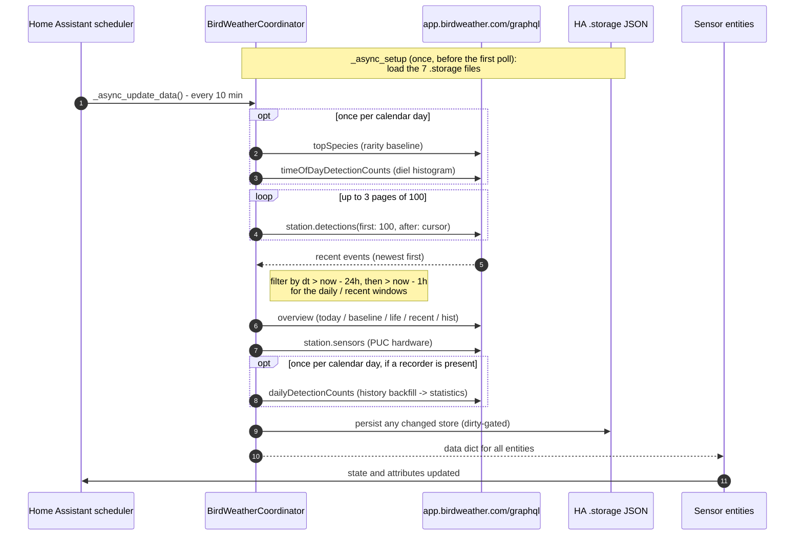

# BirdWeather API interactions

This page lists every request the integration makes to BirdWeather: which GraphQL queries it sends, when, with what variables, and what it does with the answers. It should be useful when debugging API behavior, estimating request volume, or working out what happens when BirdWeather is unreachable.

The integration only reads from BirdWeather's public GraphQL API, by polling. It never writes anything back.

## The endpoint

A single GraphQL endpoint serves everything:

```
POST https://app.birdweather.com/graphql
```

Every request is anonymous: there's no API token or account. Requests go through Home Assistant's shared `aiohttp` session (`async_get_clientsession(hass)`) with a `User-Agent: ha-birdweather` header. The station ID is a query variable, not a credential.

The integration itself never downloads photos or audio. Bird photos are BirdWeather CDN URLs that the cards load directly, with no local copy, and "play the call" streams the soundscape clip in the browser.

**Code:** every query lives in [`client.py`](../custom_components/birdweather/client.py) (`BirdWeatherClient` and the discovery helpers). [`coordinator.py`](../custom_components/birdweather/coordinator.py) runs them on each poll, [`config_flow.py`](../custom_components/birdweather/config_flow.py) uses the discovery queries during setup, and [`statistics.py`](../custom_components/birdweather/statistics.py) uses the daily-history query to fill in long-term statistics.

## Queries at a glance

| Client method | GraphQL | When | Returns |
|---|---|---|---|
| `search_stations` / `get_station` / `nearby_stations` | `stations` / `station` | Setup (finding and checking a station) | public stations |
| `get_raw_detections` | `station.detections(first:, after:)`, up to 3 pages | every poll | recent detections, newest first |
| `get_baseline_count` | `station.topSpecies(period:)` | once a day | `[{bird, count}]`, the rarity baseline |
| `get_overview` | `station { today, baseline, todayTop, life, recent, hist, earliestDetectionAt }` | every poll | BirdWeather's own totals for each period |
| `get_time_of_day` | `timeOfDayDetectionCounts(period:)` | once a day | activity by hour of day (24 values) |
| `get_sensors` | `station.sensors` | every poll | PUC hardware readings (or nulls) |
| `get_daily_history` | `dailyDetectionCounts(period:)` | once a day (statistics) | totals and species counts for each day |

## One poll cycle


```mermaid
sequenceDiagram
    autonumber
    participant HA as Home Assistant scheduler
    participant Coord as BirdWeatherCoordinator
    participant API as app.birdweather.com/graphql
    participant Store as HA .storage JSON
    participant Sensors as Sensor entities

    Note over Coord,Store: _async_setup (once, before the first poll):<br/>load the 7 .storage files
    HA->>Coord: _async_update_data() - every 10 min

    opt once per calendar day
        Coord->>API: topSpecies (rarity baseline)
        Coord->>API: timeOfDayDetectionCounts (diel histogram)
    end

    loop up to 3 pages of 100
        Coord->>API: station.detections(first: 100, after: cursor)
    end
    API-->>Coord: recent events (newest first)
    Note right of Coord: filter by dt > now - 24h, then > now - 1h<br/>for the daily / recent windows

    Coord->>API: overview (today / baseline / life / recent / hist)
    Coord->>API: station.sensors (PUC hardware)

    opt once per calendar day, if a recorder is present
        Coord->>API: dailyDetectionCounts (history backfill -> statistics)
    end

    Coord->>Store: persist any changed store (dirty-gated)
    Coord-->>Sensors: data dict for all entities
    Sensors->>HA: state and attributes updated
```

The requests run one after another; each `await` waits for the one before. The rarity baseline, the time-of-day activity and the statistics history only run once per calendar day, and are kept in memory between polls. The detection feed, the overview and the hardware sensors run on every poll.

## Discovery (config flow)

`search_stations`, `get_station` and `nearby_stations` query the public `stations` and `station` fields. The setup dialog lists public stations near Home Assistant's configured location (a bounding box, then sorted by great-circle distance), searches by name, and accepts a pasted station ID.

`get_station` checks the chosen ID. A station node means it's valid. `None`, where the API answered but found nothing, becomes the `invalid_station` error, and a network failure becomes `cannot_connect`. See [troubleshooting.md](troubleshooting.md).

## The detection feed

`get_raw_detections(station_id, first=DETECTION_FETCH_LIMIT)` fetches the most recent `DETECTION_FETCH_LIMIT` (300) detections, newest first, and converts them to the shape the rest of the pipeline expects (`cn`, `sn`, `spCode`, `dt`, `image`, `audio`, `confidence`, plus the reference links and alpha codes).

The bird feed asks BirdWeather for its `avian` class only (`detections(classifications: ["avian"])`). With bat support on, a second feed asks for `["bat"]`, up to `BAT_FETCH_LIMIT` (100) detections in one page, so bats can't push birds out of the 300. Bat records also carry `classification` and the reported `behavior`, `behavior_code` and `behavior_confidence`. See [bats.md](bats.md).

Every time window is then cut out of this one response by timestamp: the last 24 hours, and the last hour within that. So a single fetch feeds `recent_detections`, `last_detection`, new-species tracking and the 7-day rarity list. A busy station can use up the 300 detections in less than 24 hours. A query bounded by time instead of count would fix that, and it's a possible future change.

The API returns at most 100 detections per request, whatever `first` asks for, so the client fetches pages of 100 using the cursor (`pageInfo { hasNextPage endCursor }`, then `after:`), up to three requests per poll. It stops early when a page is empty, adds nothing new, or comes back without a usable cursor. It also drops duplicate detection IDs if pages overlap, so the result can be shorter than 300. Before paging, a single `first: 300` request quietly returned only the newest 100.

## Native aggregates (overview)

`get_overview` is one request that returns BirdWeather's real totals for each period, rather than anything worked out from the detection feed (which is a sample):

- today's detection total and species count
- a total over the baseline period, for `activity_level`'s typical day
- the lifetime species count
- the species that are new within the new-species window
- the day's top species, with photos
- `earliestDetectionAt`

The bird figures use the top-level `counts` and `topSpecies` queries with `classifications: ["avian"]`, since the per-station versions can't filter by class. The same request returns today's bat total and bat species list (`["bat"]`) for the bat sensors. Together these feed `daily_count`, `daily_top_species`, `species_diversity`, `activity_level`, `new_species_window`, `lifetime_species` and `history_start`.

## Rarity baseline and time of day (daily)

`get_baseline_count` returns `topSpecies` over the rarity window (1 month by default; see [advanced.md](advanced.md)) as `[{bird, count}]`, which becomes the `{species → rank}` map that rarity scoring divides by. It's birds only (`classifications: ["avian"]`), and so are the time-of-day curves and the statistics history below, which drop any rows BirdWeather classifies as bats.

`get_time_of_day` adds up the last 7 days' half-hour counts into 24 hourly values for `peak_activity_hour`. Both refresh once per calendar day and are kept between polls.

## Statistics backfill (daily)

When Home Assistant's recorder is running, `get_daily_history` fetches each day's totals and species count from the station's first recorded day to today. [`statistics.py`](../custom_components/birdweather/statistics.py) imports them into Home Assistant's long-term statistics, as a running `sum` of detections and a daily `mean` of species. It runs once per calendar day, and running it again changes nothing. See [architecture.md](architecture.md) for why this sets the 2025.4 minimum.

## Polling cadence

| Constant | Value | Source |
|---|---|---|
| `DEFAULT_SCAN_INTERVAL` | 600 s (10 min); adjustable from 5 to 60 min | [`const.py`](../custom_components/birdweather/const.py) |
| `RECENT_WINDOW_HOURS` | 1 h; cut out of the feed locally, adjustable from 1 to 24 h | [`const.py`](../custom_components/birdweather/const.py) |
| `DAILY_WINDOW_HOURS` | 24 h | [`const.py`](../custom_components/birdweather/const.py) |
| `DETECTION_FETCH_LIMIT` | 300 events/poll | [`const.py`](../custom_components/birdweather/const.py) |

At the default interval that's a handful of requests every 10 minutes (the detections, overview and sensors on every poll, plus the baseline, time of day and history once a day), which is well within any reasonable limit. The poll interval and the windows are in the options flow's **Advanced** section (see [advanced.md](advanced.md)).

## Failure handling

| Failure | What happens |
|---|---|
| The detection feed fails (a network or GraphQL error) | `_async_update_data` raises `UpdateFailed`, and the entities are unavailable until the next good poll |
| The rarity baseline query fails | Logged, and the saved baseline is kept. On the very first poll, with no saved baseline, it raises `UpdateFailed` instead, so rarity isn't scored against nothing. |
| The overview, sensors, time-of-day or history query fails | Logged, and the affected sensors keep their previous value (or `unknown`). The rest of the poll still completes. |

Failed requests aren't retried within a poll. The next poll tries again. `BirdWeatherError` covers both network errors and GraphQL `errors`, so callers only handle one kind of exception.

## Diagnostics

The diagnostics download ([`diagnostics.py`](../custom_components/birdweather/diagnostics.py)) includes the latest poll's data and a coordinator summary, with the station ID and name removed. It's safe to attach to a bug report.
