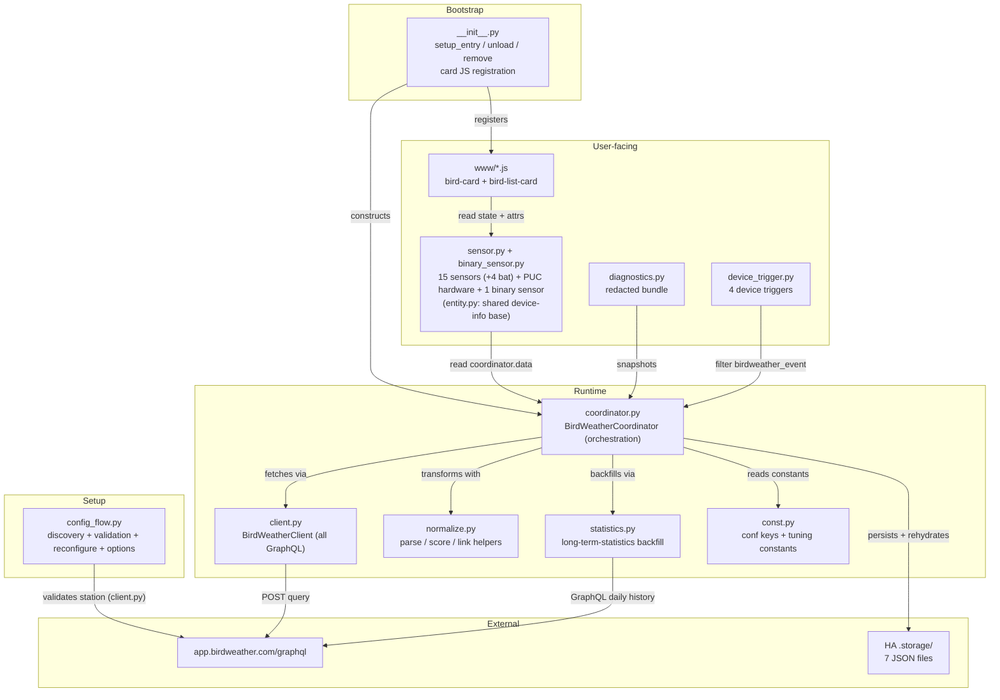
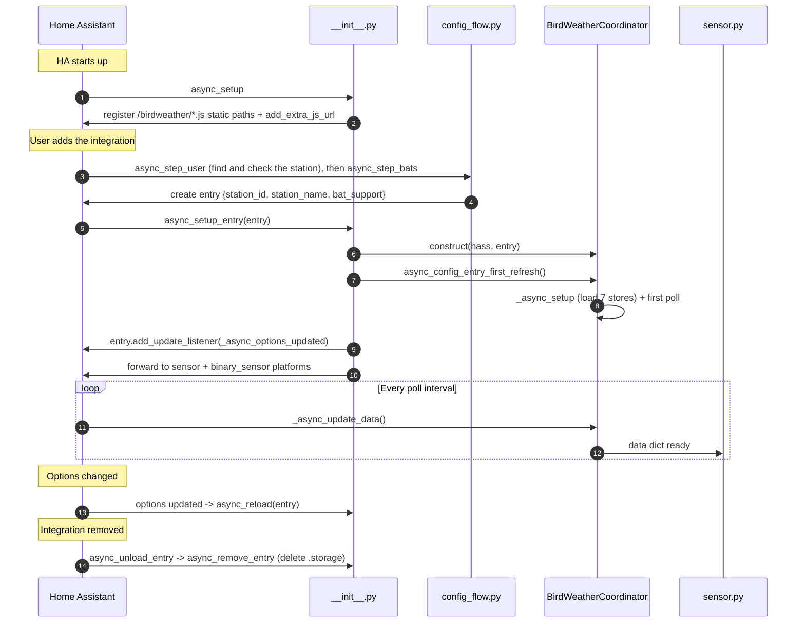

# Architecture

How the integration is put together: what each module does, how data moves through it, what's kept where, and what runs when.

For what the integration asks BirdWeather for, see [api.md](api.md). For what the sensors show, see [sensors.md](sensors.md).

## Component map



## File layout

```text
custom_components/birdweather/
├── __init__.py           # setup and teardown; serves and registers the cards; options reload
├── binary_sensor.py      # the extended-silence problem sensor
├── card_loader.py        # copies the card loader to config/www and adds it as a dashboard resource
├── client.py             # BirdWeatherClient: every GraphQL query (discovery, polling, history)
├── config_flow.py        # setup (finding the station, bat support), reconfigure, options
├── const.py              # domain, config keys, defaults, event and trigger names
├── coordinator.py        # BirdWeatherCoordinator: runs each poll
├── device_trigger.py     # new_species, unusual_visitor, watched_species and bat_activity triggers
├── diagnostics.py        # the diagnostics download, with the station removed
├── entity.py             # BirdWeatherEntity: shared device info for the platforms
├── manifest.json         # the integration's manifest; its version is bumped by hand to release
├── normalize.py          # parsing, rarity and notability scoring, link URLs (no HA state)
├── statistics.py         # loads the daily history into HA's long-term statistics
├── sensor.py             # the sensors, plus the PUC hardware sensors when the station has them
├── strings.json          # display names and UI text
├── translations/
│   └── en.json
├── brand/                # icon
└── www/
    ├── birdweather-bird-card.js     # single-bird card
    ├── birdweather-details-card.js  # the ranked list card (birdweather-bird-list-card)
    └── birdweather-card-loader.js   # startup loader, copied to config/www
```

## The coordinator runs the poll; the other modules do the work

[`coordinator.py`](../custom_components/birdweather/coordinator.py) runs each poll in order, holds the data in memory and on disk, and builds the result the sensors read. The parts it uses are separate modules:

- **`client.py`**: `BirdWeatherClient` holds every GraphQL query (discovery, the poll queries and the daily-history query), so all network access is in one place, and it's tested against a fake session.
- **`normalize.py`**: plain functions for parsing times, the confidence band, time-window filters, turning detections into one record per species, scoring rank, rarity and notability, and building the reference links. Nothing here touches the coordinator or Home Assistant.
- **`statistics.py`**: loads the daily history into long-term statistics. It imports the recorder only when it runs. The coordinator calls it through a small wrapper.

The sensors only read `self.coordinator.data`. They never call the API or keep their own state, and both platforms share their device info through `entity.py`. The config flow checks a station and saves it; it never talks to the coordinator.

### Inside `_async_update_data`

The saved files are loaded once, earlier, in `_async_setup` (the coordinator's setup hook, which runs once before the first refresh), so the poll itself never has to check whether they've loaded.

The poll runs one step at a time (no `asyncio.gather`), which keeps the order of dependencies obvious:

- the rarity baseline (refreshed once a day) has to exist before anything is scored for rarity
- the 24-hour list fills in `seen_species` on a fresh install before the recent window is checked for new species
- notability is scored last, so its recency part sees the whole 24-hour list

### Why everything funnels through one dict

The coordinator returns one `dict[str, Any]` per poll, and most keys match sensor IDs. The exceptions are on purpose: single records (`last_detection`, `notable_detection`, `new_detection`) next to their lists, `recent_events` (the list of individual detections behind `last_detection`), and `lifetime_species_count` (a number on `new_species`). These keys are the agreement between the coordinator and the sensors, so adding a sensor means adding one key and one sensor class that use the same name.

## State and persistence

The coordinator keeps three kinds of state.

### 1. Rebuilt every poll
The 1-hour recent list, the 24-hour list, the notability ranking and today's top species, all worked out again from the current detection feed and overview.

### 2. Kept in memory for the day
The rarity baseline (`topSpecies`), the time-of-day activity, and the date statistics were last imported. Each is refreshed once per calendar day and kept between polls.

### 3. Saved to disk (`.storage/`, seven files per station)

| Store | Rehydrated by | Contents |
|---|---|---|
| `birdweather.<id>.seen_species` | `_async_setup` | when each species was first heard, for the life of the station (the one you'd least want to lose) |
| `birdweather.<id>.last_seen` | `_async_setup` | species → when it was last heard (busy; written most polls) |
| `birdweather.<id>.yearly` | `_async_setup` | the rarity baseline ranks |
| `birdweather.<id>.seven_day` | `_async_setup` | each day's records for the 7-day `rarest_species` list (busy) |
| `birdweather.<id>.recent_events` | `_async_setup` | the last 50 detections, behind `last_detection` (busy) |
| `birdweather.<id>.species_meta` | `_async_setup` | the per-species details that rarely change (codes, scientific names, photo URLs, photo credits, reference links), plus `bats`: each bat seen, by name, with its photo and links (bats have no eBird code to look the other details up by) |
| `birdweather.<id>.last_by_class` | `_async_setup` | the newest bird and newest bat detection, kept apart from the event buffer so a night of bats can't push out the last bird |

Each file is only written when its data changes, tracked with a dirty flag. The split is on purpose. Home Assistant's `Store` rewrites the whole file on any change, so the busy files (`last_seen`, `seven_day`, `recent_events`) and the irreplaceable `seen_species` are kept apart from the per-species details, which only change when a species is heard for the first time. Those details share one file, `species_meta`, so a new species costs one write instead of five.

There's no photo or audio cache on disk. Bird photos are BirdWeather CDN URLs that the cards load directly, and audio streams the soundscape clip in the browser.

### Migrating saved files
On the first load after an upgrade, `_load_stores` moves the five older per-detail files into `species_meta` (and then deletes them), and deletes the old `.sticky` file, which the saved detection list and the live notable sensor replaced. When an entry is removed, `async_remove_entry` deletes all of that station's files, old and current.

## Lifecycle



### Minimum HA version

`hacs.json` sets the minimum to Home Assistant 2025.4. The reason is the recorder statistics API used by [`statistics.py`](../custom_components/birdweather/statistics.py): `StatisticMeanType` and the `mean_type` field on `StatisticMetaData` arrived in 2025.4.0, and on older versions the import fails. The code also passes `unit_class=None`, which only became a real `StatisticMetaData` field in 2025.11. Older versions ignore it.

Some newer APIs are used where they exist, with a fallback for older versions. Each fallback only runs on an older Home Assistant, so test those changes on the minimum too (see [contributing.md](contributing.md#setup)):

| API | Since | Used for | Fallback |
|---|---|---|---|
| `UpdateFailed(retry_after=...)` | 2025.12 | Honoring `Retry-After` when the detection feed fails | A plain `UpdateFailed` |
| `DeviceEntry.config_entry_id` | 2026.8 | `device_trigger` checking for bat support; `config_entries` is deprecated from 2026.10 | `config_entries` |
| `async_get_device_by_identifier` | 2026.8 | Finding the device for `birdweather_event` and the old serial-number cleanup; `async_get_device` is deprecated from 2026.9 | `async_get_device` |
| `UnitOfRatio.PARTS_PER_MILLION` | absent in 2026.2, present by 2026.8 | The VOC sensor's unit; `CONCENTRATION_PARTS_PER_MILLION` is deprecated and removed in 2027.8 | `CONCENTRATION_PARTS_PER_MILLION` |

Reconfigure finishes with `async_update_entry` and then `async_abort`, rather than `async_update_and_abort`, because `ConfigFlow` doesn't have that helper on 2025.4. The entry's update listener does the single reload.

## Custom cards

The two cards in `www/` are registered in `async_setup`:

- `birdweather-bird-card`: one bird, with an ⓘ button that pops up the details view.
- `birdweather-bird-list-card`: a ranked list whose rows expand, with confidence labels, Wikipedia descriptions, a daily activity chart, reference-link buttons, and an optional play button.

They read sensor state over Home Assistant's WebSocket and know nothing about the coordinator. Their URLs carry `?v=<version>`, so browsers fetch the new code after an upgrade. `card_loader.py` also copies `birdweather-card-loader.js` to `config/www` and adds it as a dashboard resource, so the cards load on pages opened while Home Assistant is still starting (see [troubleshooting.md](troubleshooting.md#cards-show-custom-element-doesnt-exist-after-a-restart)).

The cards are generated from the Haikubox integration's cards by `scripts/sync-cards.sh`, which swaps the brand names and flips a few feature switches, and the BirdWeather reference link is added back by hand. See [cards.md](cards.md).

## Automation events

The coordinator fires one event, `birdweather_event`, for detections worth knowing about, with a `type` field saying which kind: `new_species`, `unusual_visitor`, `watched_species` or `bat_activity`. That's the one-event, many-types pattern Home Assistant uses for `deconz_event` and `bthome_ble_event`. [`device_trigger.py`](../custom_components/birdweather/device_trigger.py) offers each type as a device trigger by handing off to the core event trigger, filtered to this device's events of that type. `bat_activity` is only offered with bat support on. The four blueprints under `blueprints/automation/birdweather/` are examples; see [automations.md](automations.md).

## Design choices worth knowing

- **One coordinator for everything.** Every sensor and the binary sensor share one `DataUpdateCoordinator`, so updating any one of them refreshes them all. The custom-schedule recipe in [advanced.md](advanced.md) relies on that.
- **`_unrecorded_attributes = {"detections"}` on every sensor.** The lists can be 50 or more records with details, and recording them on every state change would bloat the recorder database. They stay on the live state for the cards.
- **`last_detection` is saved; `notable_species` empties out.** `last_detection` comes from a saved list of recent detections, so it survives restarts and outages. `notable_species` only covers the live 24 hours and goes to `unknown` when nothing is heard, which makes it a deliberate sign that the station has gone quiet.
- **Real counts, not the feed.** The volume, diversity and new-species sensors use BirdWeather's own totals for each period. The detection feed is a sample ordered by time, and counting from it would skew the numbers.
- **Options reload the entry, not just refresh it.** Some settings (the poll interval) are read once when the coordinator is created, so a refresh alone wouldn't pick them up.
- **Cards read state, not the coordinator.** A card's YAML works on any Home Assistant instance that has the sensors.
